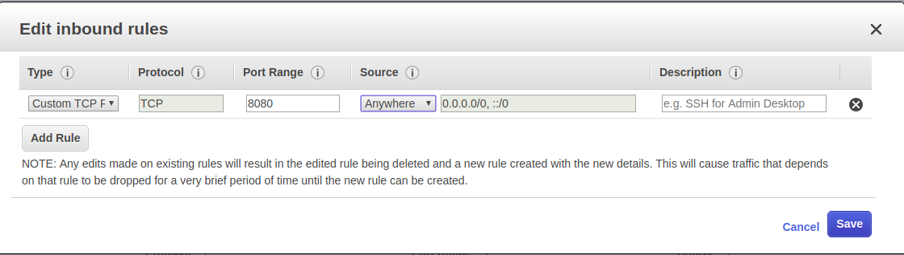

# Script for Tomcat Installation
This script is to install and configure Tomcat 9 in Ubuntu 18.04 machine locally or in cloud.

##Instructions

### Step 1: Clone this script
```
	$ git clone https://github.com/ajaitx/shellscripts.git
```
### Step 2: Add execute persmision and run 
```
	$ sudo chmod +x install_tomcat.sh
	$ sudo ./install_tomcat.sh
```
Now tomcat server will be installed successfully.

### Step 2: Access tomcat server
If the tomcat is configured in AWS EC2 instance, then open the port 8080 in 'inbound' ip rules like below and access through the DNS or IP of the EC2 instance.
 
 
**Or**

If the tomcat is configured in local system, access it through IP address of the system

"Eg: http://"IP address of the system":8080/"


Note: For more details about the inbound/outbound ip rule configuration in AWS EC@, refer the this [AWS_EC2_security_modification_instructions](./docs/AWS_EC2_security_modification_instructions.docx)
